<h2>TensorFlow-FlexUNet-Image-Segmentation-EMIDEC-Heart-MRI (2026/05/15)</h2>
Sarah T. Arai 
Software Laboratory antillia.com  
This is the first experiment of Image Segmentation for <b>EMIDEC-Heart-MRI (3 classes)</b> based on 
our <a href="./src/TensorFlowFlexUNet.py">TensorFlowFlexUNet</a>
 (<b>TensorFlow Flexible UNet Image Segmentation Model for Multiclass</b>), and a 512x512 pixles upscaled PNG
 <a href="https://drive.google.com/file/d/1DJT8p1_Jwt4IWJcNVWsXMzDnrrYQpevk/view?usp=drive_link">
Augmented-EMIDEC-Heart-MRI-ImageMask-Dataset.zip (RESTRICTED) </a> with colorized masks (<a href="https://creativecommons.org/licenses/by-nc/4.0/legalcode">
Creative Commons Attribution Non Commercial 4.0 International
</a>), which was derived by us from   
<a href="https://www.kaggle.com/datasets/johnsonhk88/emidec-dataset-for-heart-mri-image/data">
<b>EMIDEC Dataset For Heart MRI Image</b></a> by Johnson chong.
  

<b>Actual Image Segmentation for EMIDEC-Heart-MRI Images of 512x512 pixels</b> 
As shown below, the inferred masks predicted by our segmentation model trained by the dataset appear similar to the 
ground truth masks.
  
<b>class_color_map = {Myocardial Infarction:red, Myocardium:green}</b>
  
<table>
<tr>
<th>Input: image</th>
<th>Mask (ground_truth)</th>
<th>Prediction: inferred_mask</th>
</tr>
<tr>
<td>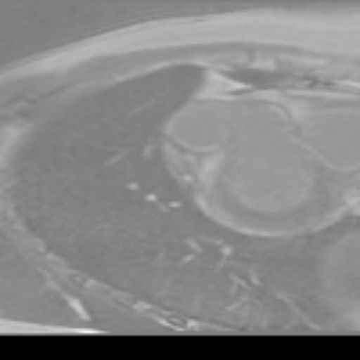</td>
<td></td>
<td>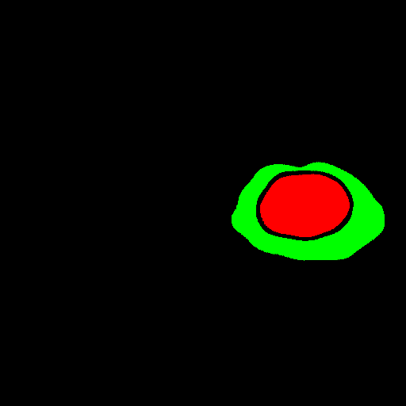</td>
</tr>
<tr>
<td>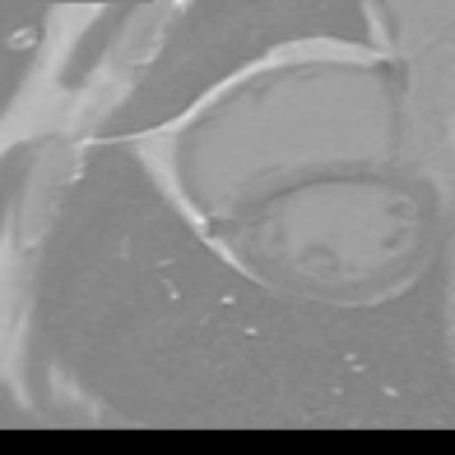</td>
<td></td>
<td></td>
</tr>
<tr>
<td>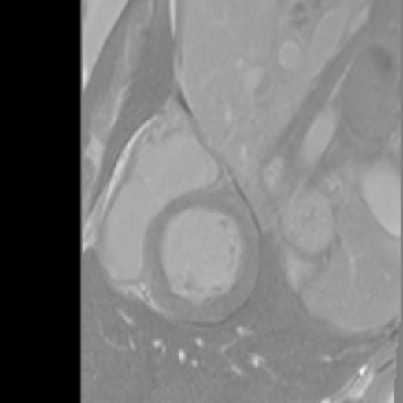</td>
<td></td>
<td>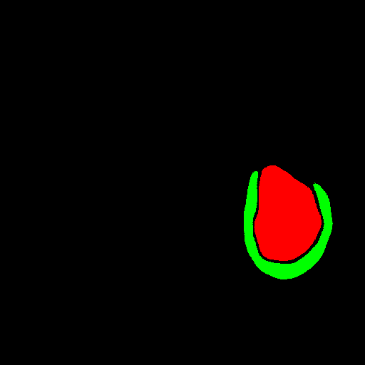</td>
</tr>
</table>

 
<h3>1. Dataset Citation</h3>
The dataset used here was taken from   
<a href="https://www.kaggle.com/datasets/johnsonhk88/emidec-dataset-for-heart-mri-image/data">
<b>EMIDEC Dataset For Heart MRI Image</b></a> by Johnson chong.
  
For more information, 
please refer to 
<a href="https://emidec.com/">EMIDEC</a>.
  
The following explanation was taken from the above kaggle site. 
  
<b>About Dataset</b> 
<b>Dataset Information</b> 
EMIDEC (Evaluation of Myocardial Infarction from Delayed-Enhancement Cardiac MRI) is a dataset aimed at assessing 
the extent of myocardial infarction.  
This dataset includes delayed-enhancement magnetic resonance imaging (DE-MRI) of multiple patients taken minutes 
after contrast injection, manually annotated to identify several myocardial infarction-related areas 
including the myocardial outline, infarction regions, and permanent microvascular obstruction areas (no reflow zones),
 forming a segmentation dataset.  
 It comprises 150 cases (all from different patients), 
 including 50 cases with normal MRI post-contrast injection and 100 cases of myocardial infarction 
 (appearing as enhanced areas on DE-MRI). The dataset includes 100 training cases and 50 test cases.
  
The dataset, with 150 clinical MRI images and associated clinical features of myocardial infarction, 
holds significant research value.  
It provides a foundation for assessing and automatically detecting myocardial infarctions, aiding in 
the development of automated algorithms to identify areas of myocardial damage, and supporting the 
development of diagnostic tools based on imaging and clinical data. Due to its large number of 
cases and comprehensive information,
 this dataset has significant potential for application in the diagnosis and treatment of myocardial infarction.
  
<b>Dataset Meta Information</b> 
Dimensions Modality Task Type Anatomical Area Number of Categories Data Volume File Format
3D DE-MRI Segmentation Heart 4 150 .nii.gz  
<b>Resolution Details</b> 
Dataset Statistics spacing (mm) size 
min (1.367, 1.367, 8.0) (139, 120, 4) 
median (1.458, 1.458, 10.0) (240, 256, 7) 
max (1.875, 1.875, 13.04) (305, 308, 10) 
 
<b>Label Information Statistics</b> 
Only 100 examples in the training set are counted. 
Region Number of Cases Completion Rate Minimum Volume (cm³) Median Volume (cm³) Maximum Volume (cm³) 
Left Ventricle 100 100% 49.28 105.46 280.77 
Myocardium 100 100% 53.81 96.5 153.83 
Myocardial Infarction 67 67% 2.39 20.26 80.1 
No Reflow 40 40% 0.32 2.35 36.74  

<b>License</b> 
<a href="https://www.mit.edu/~amini/LICENSE.md">
MIT</a>
 
 
<h3>
2 EMIDEC-Heart-MRI ImageMask Dataset
</h3>
<h3>2.1 Download EMIDEC-Heart-MRI-ImageMask-Dataset</h3>
 If you would like to train this EMIDEC-Heart-MRI Segmentation model by yourself,
 please download the dataset from the google drive  
 <a href="https://drive.google.com/file/d/1DJT8p1_Jwt4IWJcNVWsXMzDnrrYQpevk/view?usp=drive_link">
Augmented-EMIDEC-Heart-MRI-ImageMask-Dataset.zip (RESTRICTED)</a> (
<a href="https://creativecommons.org/licenses/by-nc/4.0/legalcode">
Creative Commons Attribution Non Commercial 4.0 International</a>)
, expand the downloaded ImageMaskDataset and put it under <b>./dataset</b> folder to be
 
<pre>
./dataset
└─EMIDEC-Heart-MRI
    ├─test
    │   ├─images
    │   └─masks
    ├─train
    │   ├─images
    │   └─masks
    └─valid
        ├─images
        └─masks
</pre>
 
<b>EMIDEC-Heart-MRI Statistics</b> 
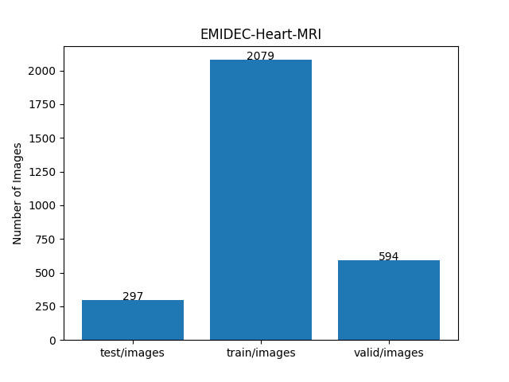 
 
As shown above, the number of images of train and valid datasets is not so large to use for the
 training set of our segmentation model.
 
<h3>2.2 Derivation of ImageMask-Dataset</h3>
The folder structure of the emidec-dataset-1.0.1 is the following. 
<pre>
./emidec-dataset-1.0.1
├─Case_N006
│  ├─Contours
│  │  └─Case_N006.nii
│  └─Images
│      └─Case_N006.nii
├─Case_N012
...
└─Case_P100
    ├─Contours
    │  └─Case_P100.nii
    └─Images
        └─Case_P100.nii

</pre>
<b>Step 1</b> 
We generated a master   
PNG ImageMask dataset with multi-class colorized masks (label_1:red, label_2:green, excepting label_3), from all pairs of <b>"Case_*/Images/Case_*.nii"</b> and
<b>"Case_*/Contours/Case_*.nii"</b> files in <b>"emidec-dataset-1.0.1"</b> folder.
However, in some cases, the shapes of the 3D volume files in <b>"Images/Case_*.nii"</b> did not match those 
in the corresponding <b>"Contours/Case_*.nii"</b>. To generate a proper dataset, we excluded these unmatched cases. 
Furthermore, even within the matched cases, we removed all empty black masks and their corresponding image slices 
because they were irrelevant to training our segmentation model.
  
<b>Step 2</b> 
We geneated a 512x512 pixels upscaled dataset
by cropping square regions from the master images and masks,
and resizing them to 512x512 pixels. 

  
<b>Step 3</b> 
We genereated our dataset from the upscaled one by using following image deformation tools. 
<a href="https://github.com/sarah-antillia/Image-Deformation-Tool">Image-Deformation-Tool</a> 
<a href="https://github.com/sarah-antillia/Image-Distortion-Tool">Image-Distortion-Tool</a>  
<a href="https://github.com/sarah-antillia/Barrel-Image-Distortion-Tool">Barrel-Image-Distortion-Tool</a>  
 
<h3>2.3 Train Sample Images and Nasks</h3>
.
<b>Train sample images</b> 
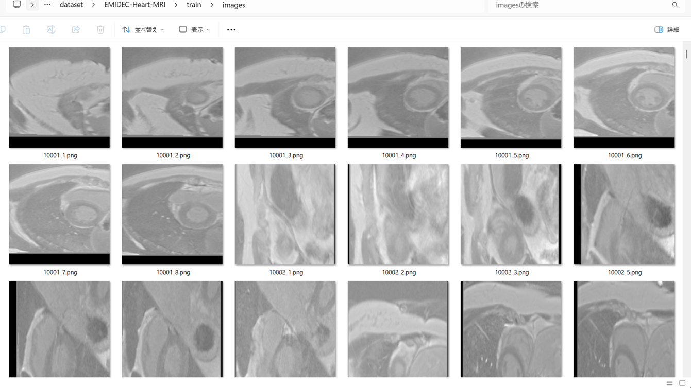
 
<b>Train sample masks</b> 
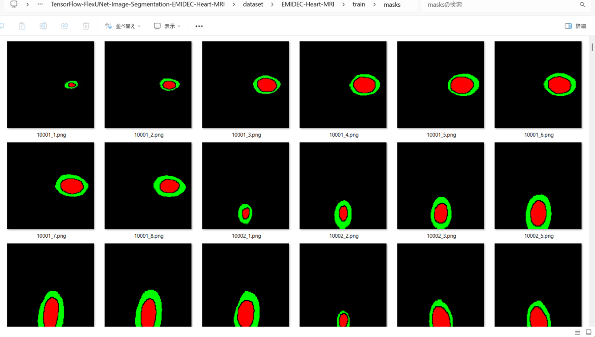
 

<h3>
3 Train TensorFlowFlexUNet Model
</h3>
 We trained EMIDEC-Heart-MRI TensorFlowFlexUNet Model by using the 
<a href="./projects/TensorFlowFlexUNet/EMIDEC-Heart-MRI/train_eval_infer.config"> <b>train_eval_infer.config</b></a> file.  
Please move to ./projects/TensorFlowFlexUNet/EMIDEC-Heart-MRI and run the following bat file. 
<pre>
>1.train.bat
</pre>
, which simply runs the following command. 
<pre>
>python ../../../src/TensorFlowFlexUNetTrainer.py ./train_eval_infer.config
</pre>

<b>Model parameters</b> 
Defined a small <b>base_filters=16 </b> and large <b>base_kernels=(11,11)</b> for the first Conv Layer of Encoder Block of 
<a href="./src/TensorFlowFlexUNet.py">TensorFlowFlexUNet.py</a> 
and a large <b>num_layers=8</b> (including a bridge between Encoder and Decoder Blocks).
<pre>
[model]
;You may specify your own UNet class derived from our TensorFlowFlexModel
model         = TensorFlowFlexUNet"
image_width    = 512
image_height   = 512
image_channels = 3
input_normalize = True
normalization  = False
num_classes    = 3
base_filters   = 16
base_kernels   = (11,11)
num_layers     = 8
dropout_rate   = 0.04
dilation       = (1,1)
</pre>
<b>Learning rate</b> 
Defined a small learning rate.  
<pre>
[model]
learning_rate  = 0.00007
</pre>
<b>Loss and metrics functions</b> 
Specified "categorical_crossentropy" and <a href="./src/dice_coef_multiclass.py">"dice_coef_multiclass"</a>. 
<pre>
[model]
loss           = "categorical_crossentropy"
metrics        = ["dice_coef_multiclass"]
</pre>
<b>Dataset class</b> 
Specifed <a href="./src/ImageCategorizedMaskDataset.py">ImageCategorizedMaskDataset</a> class. 
<pre>
[dataset]
class_name    = "ImageCategorizedMaskDataset"
</pre>
 
<b>Learning rate reducer callback</b> 
Enabled learing_rate_reducer callback, and a small reducer_patience.
<pre> 
[train]
learning_rate_reducer = True
reducer_factor     = 0.4
reducer_patience   = 4
</pre>
<b>Early stopping callback</b> 
Enabled early stopping callback with patience parameter.
<pre>
[train]
patience      = 10
</pre>
<b>RGB Color map</b> 
Specifed rgb color map dict for EMIDEC-Heart-MRI 1+2 classes. 
<pre>
[mask]
mask_datatyoe    = "categorized"
mask_file_format = ".png"
;EMIDEC-Heart-MRI rgb color map dict for 1+2 classes.
;          Myocardial Infarction:red, Myocardium:green,   
rgb_map = {(0,0,0):0, (255, 0, 0):1, (0,255,0):2,}
</pre>
<b>Epoch change inference callback</b> 
Enabled <a href="./src/EpochChangeInferencer.py">epoch_change_infer callback</a></b>. 
<pre>
[train]
epoch_change_infer       = True
epoch_change_infer_dir   =  "./epoch_change_infer"
num_infer_images         = 6
</pre>
By using this callback, on every epoch_change, the inference procedure can be called
 for 6 images in <b>mini_test</b> folder. This will help you confirm how the predicted mask changes 
 at each epoch during your training process.  
  
As shown below, early in the model training, the predicted masks from our UNet segmentation model showed 
discouraging results.
 However, as training progressed through the epochs, the predictions gradually improved. 
   
 
<b>Epoch_change_inference output at starting (epoch 1,2,3)</b> 
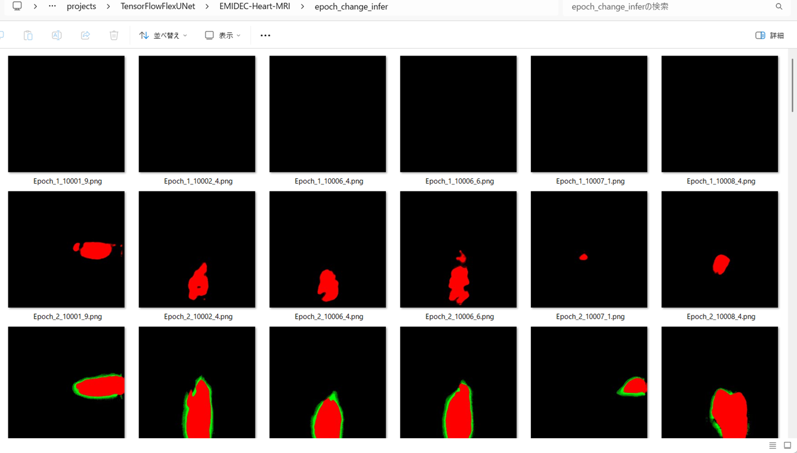 
 
<b>Epoch_change_inference output at middlepoint (epoch 8,9,10)</b> 
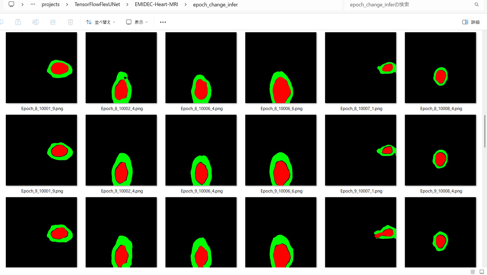 
 

<b>Epoch_change_inference output at ending (epoch 18,19,20)</b> 
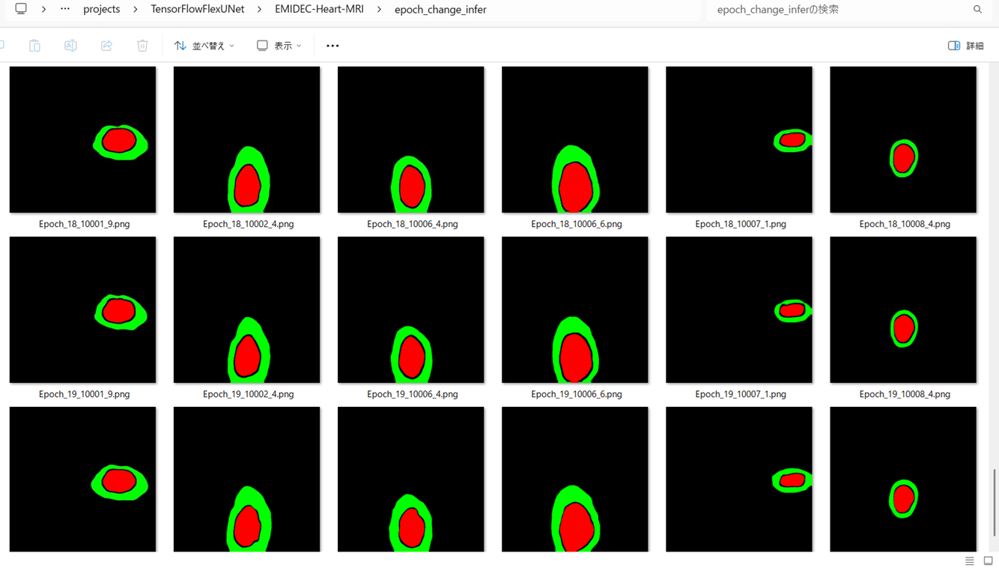 
 

In this experiment, the training process was terminated at epoch 20.  
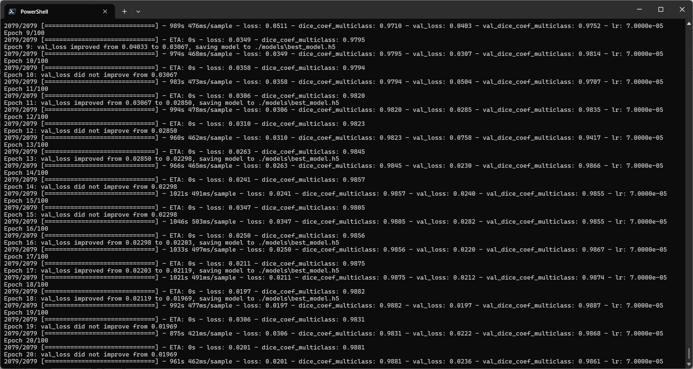 
 

<a href="./projects/TensorFlowFlexUNet/EMIDEC-Heart-MRI/eval/train_metrics.csv">train_metrics.csv</a> 
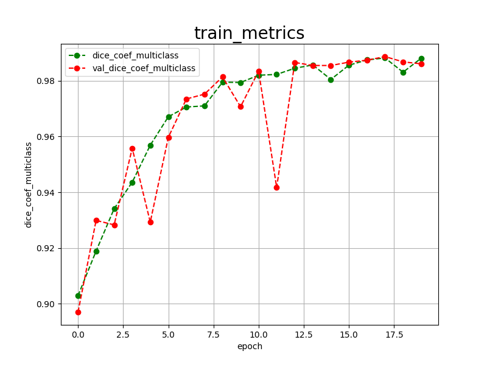 

 
<a href="./projects/TensorFlowFlexUNet/EMIDEC-Heart-MRI/eval/train_losses.csv">train_losses.csv</a> 
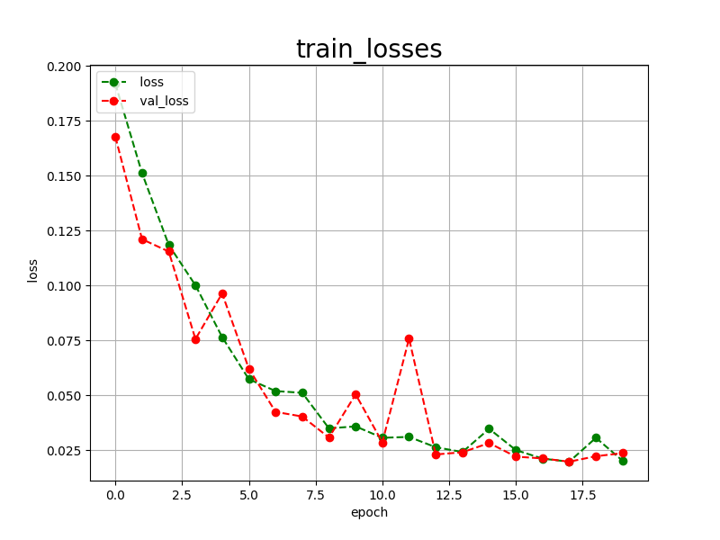 
 
<h3>
4 Evaluation
</h3>
Please move to <b>./projects/TensorFlowFlexUNet/EMIDEC-Heart-MRI</b> folder, 
and run the following bat file to evaluate TensorFlowUNet model for EMIDEC-Heart-MRI. 
<pre>
>./2.evaluate.bat
</pre>
This bat file simply runs the following command.
<pre>
>python ../../../src/TensorFlowFlexUNetEvaluator.py ./train_eval_infer_aug.config
</pre>

Evaluation console output: 
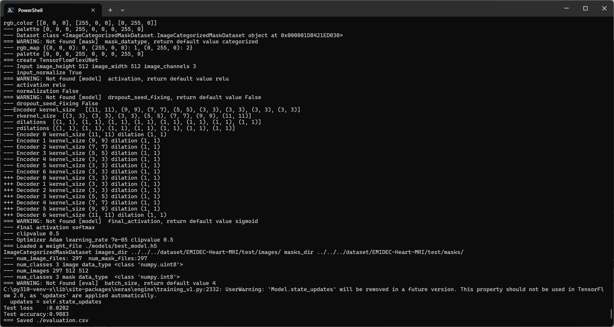
  Image-Segmentation-EMIDEC-Heart-MRI

<a href="./projects/TensorFlowFlexUNet/EMIDEC-Heart-MRI/evaluation.csv">evaluation.csv</a> 
The loss (categorical_crossentropy) to this <b>EMIDEC-Heart-MRI/test</b> was not low and dice_coef_multiclass nots high as shown below.
 
<pre>
categorical_crossentropy,0.0202
dice_coef_multiclass,0.9883
</pre>
 
<h3>
5 Inference
</h3>
Please move to a <b>./projects/TensorFlowFlexUNet/EMIDEC-Heart-MRI</b> folder 
,and run the following bat file to infer segmentation regions for images by the Trained-TensorFlowUNet model for EMIDEC-Heart-MRI. 
<pre>
>./3.infer.bat
</pre>
This simply runs the following command.
<pre>
>python ../../../src/TensorFlowFlexUNetInferencer.py ./train_eval_infer_aug.config
</pre>

<b>mini_test_images</b> 
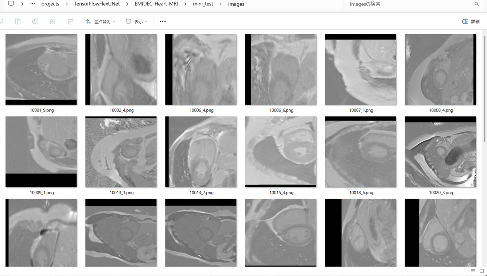 
<b>mini_test_mask(ground_truth)</b> 
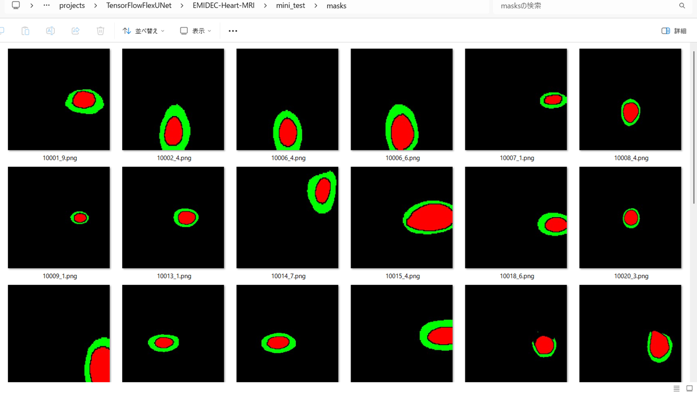 

<b>Inferred test masks</b> 
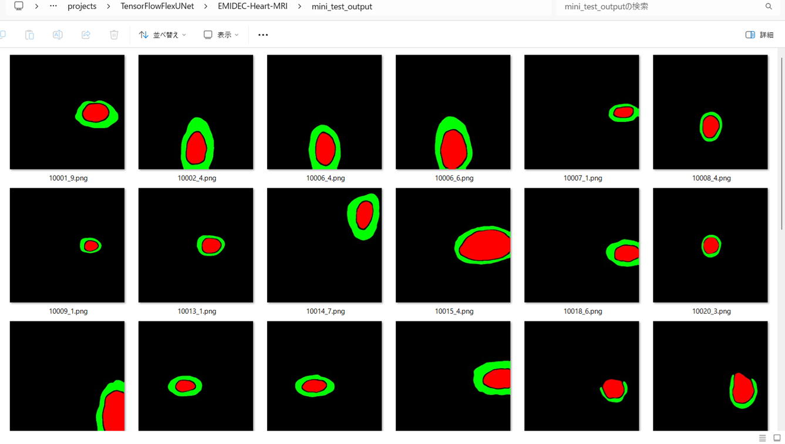 
 

<b>Enlarged images and masks of EMIDEC-Heart-MRI Images of 512x512 pixels</b> 
As shown below, the inferred masks predicted by our segmentation model trained by the dataset appear similar to 
the ground truth masks.
  
<b>class_color_map = {Myocardial Infarction:red, Myocardium:green}</b>
  
<table>
<tr>
<th>Image</th>
<th>Mask (ground_truth)</th>
<th>Inferred-mask</th>
</tr>
<tr>
<td>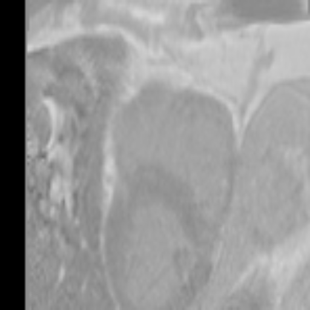</td>
<td></td>
<td>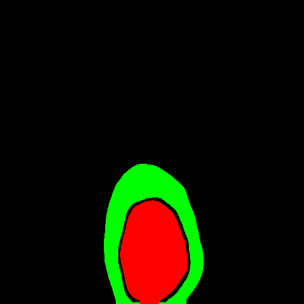</td>
</tr>

<tr>
<td>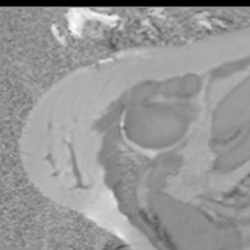</td>
<td></td>
<td>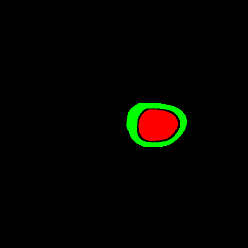</td>
</tr>

<tr>
<td>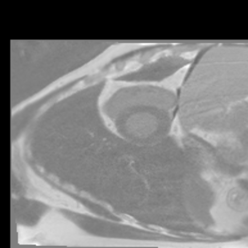</td>
<td></td>
<td>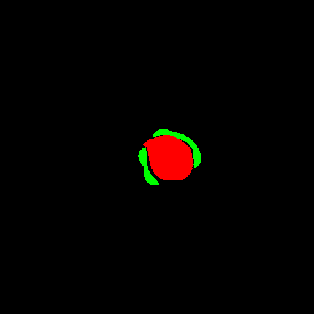</td>
</tr>

<tr>
<td>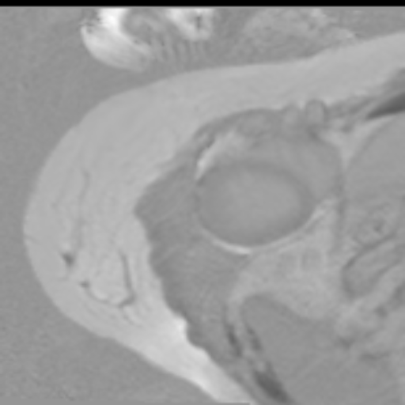</td>
<td></td>
<td>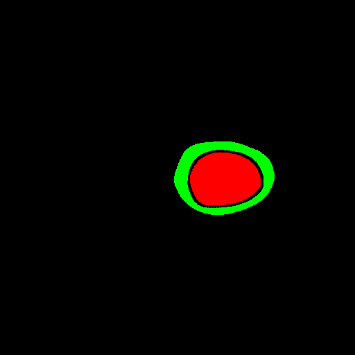</td>
</tr>

<tr>
<td>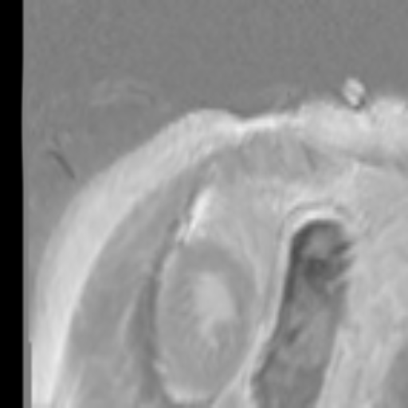</td>
<td></td>
<td></td>
</tr>

<tr>
<td>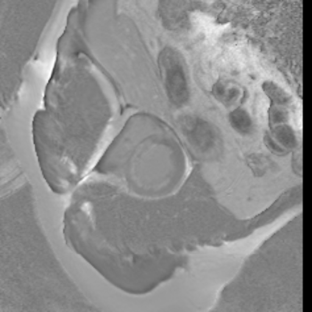</td>
<td></td>
<td>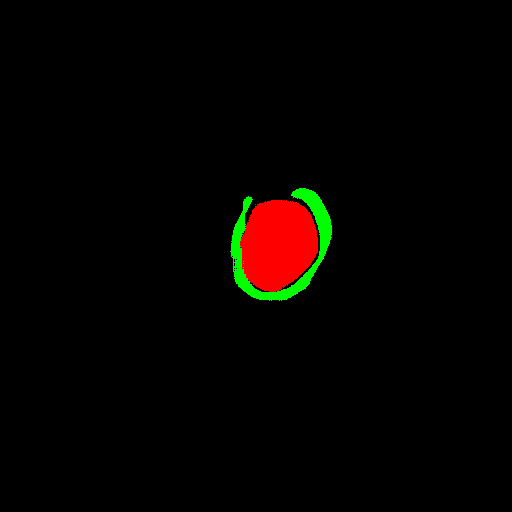</td>
</tr>
</table>

 

 
<h3>
6 3D Volume Segmentation
</h3>
Please move <b>./projects/TensorFlowFlexUNet/EMIDEC-Heart-MRI</b> folder, and run the following bat file to infer images segmentation for 2D slices of 3D volume NIfTI files
 by the Trained-TensorFlowFlexUNet model for EMIDEC-Heart-MRI. 
<pre>
>./5.infer3d.bat
</pre>
This simply runs the following command.
<pre>
>python ../../../src/TensorFlowFlexUNet3DInferencer.py ./train_eval_infer.config
</pre>

<b>infer3d section </b> in <a href="./projects/TensorFlowFlexUNet/EMIDEC-Heart-MRI/train_eval_infer.config">
train_eval_infer.config
<a></b>
<pre>
[infer3d] 
;Specify an images_dir which contains NIfTI or MHA files
images_dir    = "./mini_test_3d/images/"
output_dir    = "./mini_test_3d_output/"
slice_shape_order = "dhw"
slice_normalize = True
slice_resize   = (512,512)
slice_rotation = None
mask_overlay  = True
</pre>

<b>Acutual Image Segmentation for 2D Slices of a EMIDEC-Heart-MRI MHA</b> 
Some Slices, Inferred Masks and Mask overlays for a 3D volume <b>0_Case_118.nii</b> file in <b>emidec-segmentation-testset-1.0.0/Case_120/Images</b>
 folder. 
 
<b>class_color_map = {Myocardial Infarction:red, Myocardium:green}</b>
 
<table>
<tr>
<th>Input: Slice</th>
<th>Prediction: Inferred mask</th>
<th>Mask Overlay</th>
</tr>
<tr>
<td>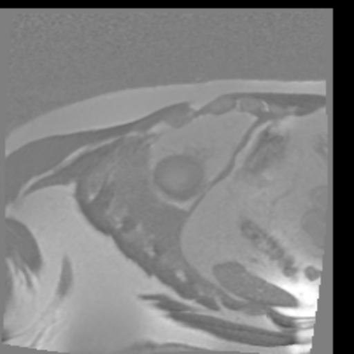</td>
<td>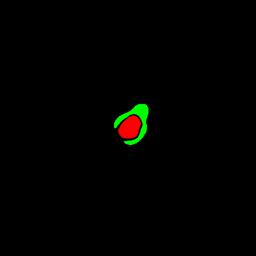</td>
<td></td>
</tr>
<tr>
<td>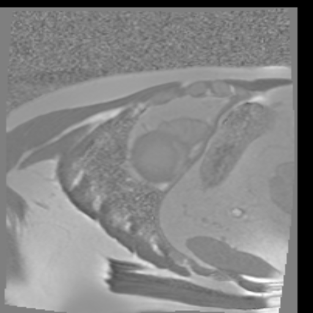</td>
<td>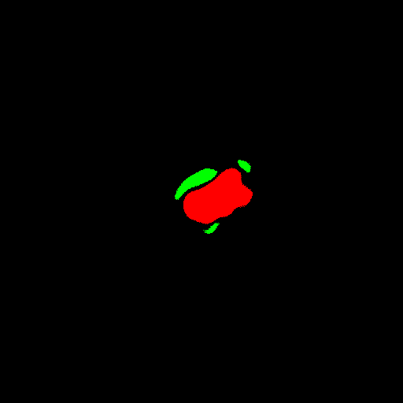</td>
<td>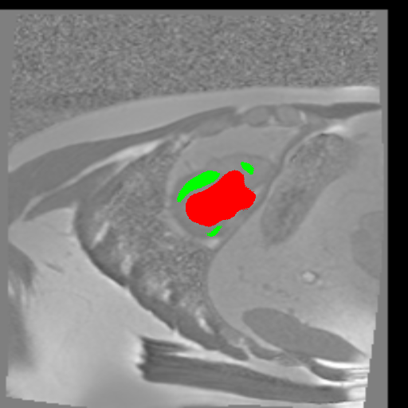</td>
</tr>
<tr>
<td>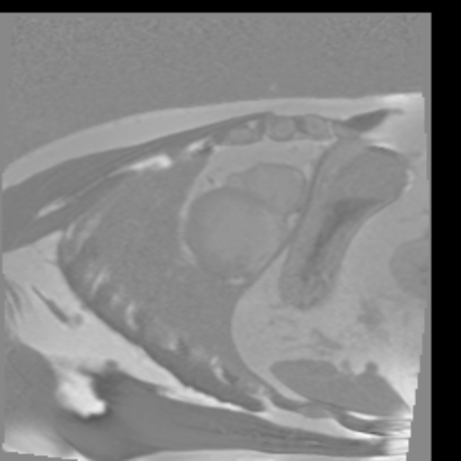</td>
<td>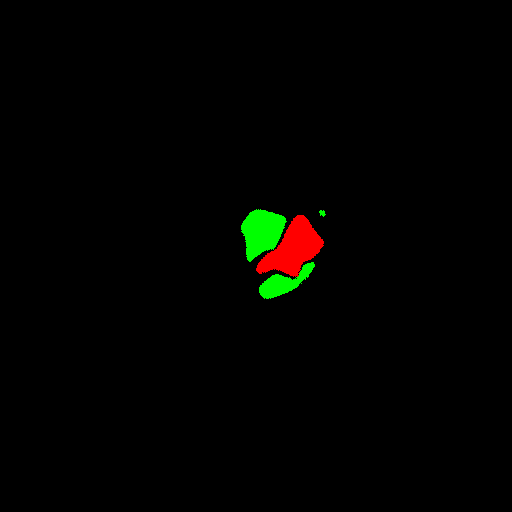</td>
<td>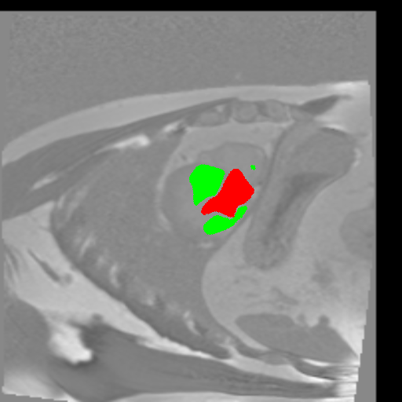</td>
</tr>
<tr>
<td>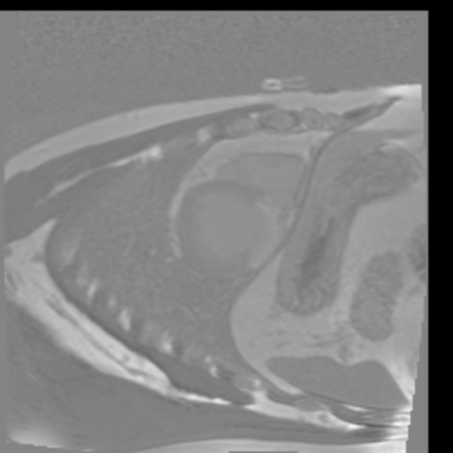</td>
<td>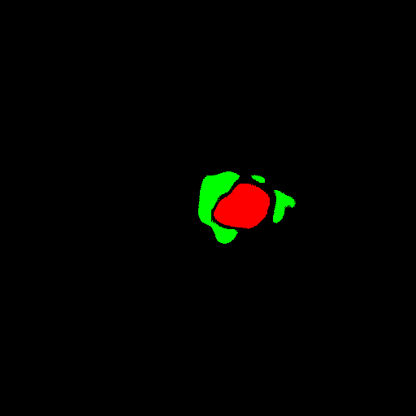</td>
<td>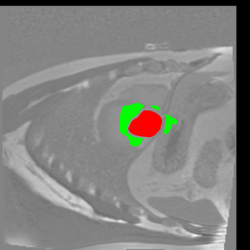</td>
</tr>
<tr>
<td>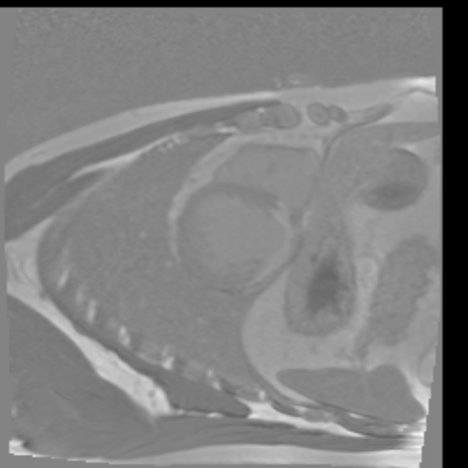</td>
<td>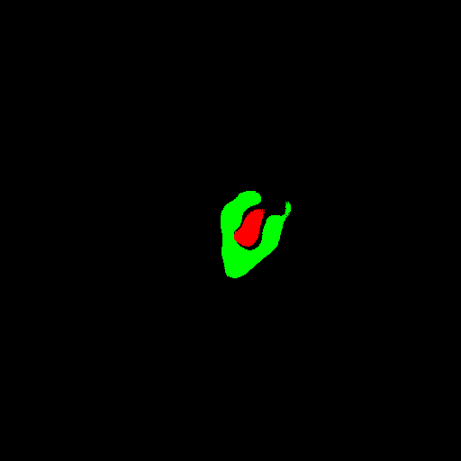</td>
<td>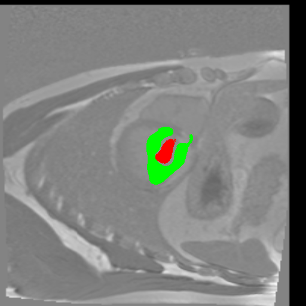</td>
</tr>
<tr>
<td>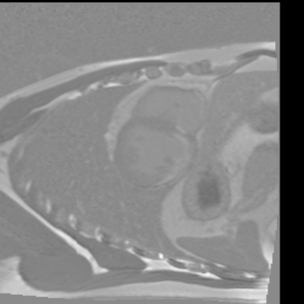</td>
<td>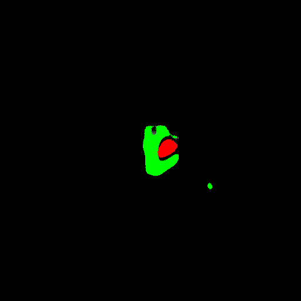</td>
<td>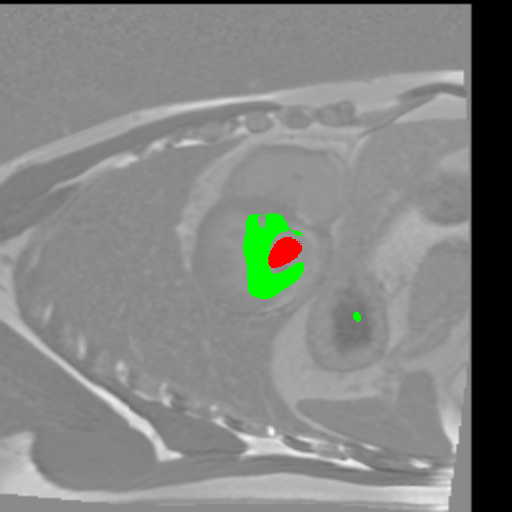</td>

</tr>
</table>

 
 
<h3>
7 MaskOverlay Video of 3D Volume Segmentation
</h3>
Please move to <b>./projects/TensorFlowFlexUNet/EMIDEC-Heart-MRI</b> folder, and run the following bat file 
to generate <b>overlays.mp4</b> or <b>overlay.gif</b> for MaskOverlays of 3D Volume Segmentation.  
<pre>
>./6.video3d.bat
</pre>
This simply runs the following command.
<pre>
>python ../../../src/MaskOverlayVideoGenerator.py ./train_eval_infer.config
</pre>
 

<b>infer3d section </b> in <a href="./projects/TensorFlowFlexUNet/EMIDEC-Heart-MRI/train_eval_infer.config">
train_eval_infer.config
<a></b>

<pre>
[infer3d] 
mask_overlay  = True
;Specify ".mp4" or ".gif".
;video_fileformat  = ".mp4"
video_fileformat  = ".gif"
</pre>
 
<b>overlays.gif</b> 
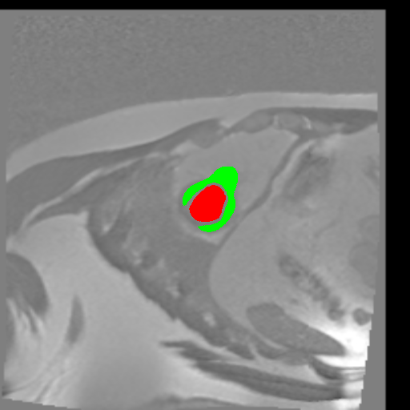
 
 
<h3>
References
</h3>
<b>1. A hybrid segmentation and classification CAD framework for automated myocardial infarction prediction from MRI images</b> 
Mugahed A. Al-antari, Riyadh M. Al-Tam, Aymen M. Al-Hejri, Zaid Al-Huda, Soojeong Lee, Özal Yıldırım & Yeong Hyeon Gu 
<a href="https://www.nature.com/articles/s41598-025-98893-1">https://www.nature.com/articles/s41598-025-98893-1</a>
  
<b>2. Cascaded Convolutional Neural Network for
Automatic Myocardial Infarction Segmentation
from Delayed-Enhancement Cardiac MRI</b> 
Yichi Zhang 
<a href="https://arxiv.org/pdf/2012.14128">
https://arxiv.org/pdf/2012.14128</a>
  
<b>3. TensorFlow-FlexUNet-Image-Segmentation-Model</b> 
Toshiyuki Arai 
<a href="https://github.com/sarah-antillia/TensorFlow-FlexUNet-Image-Segmentation-Model">
https://github.com/sarah-antillia/TensorFlow-FlexUNet-Image-Segmentation-Model</a>
  

